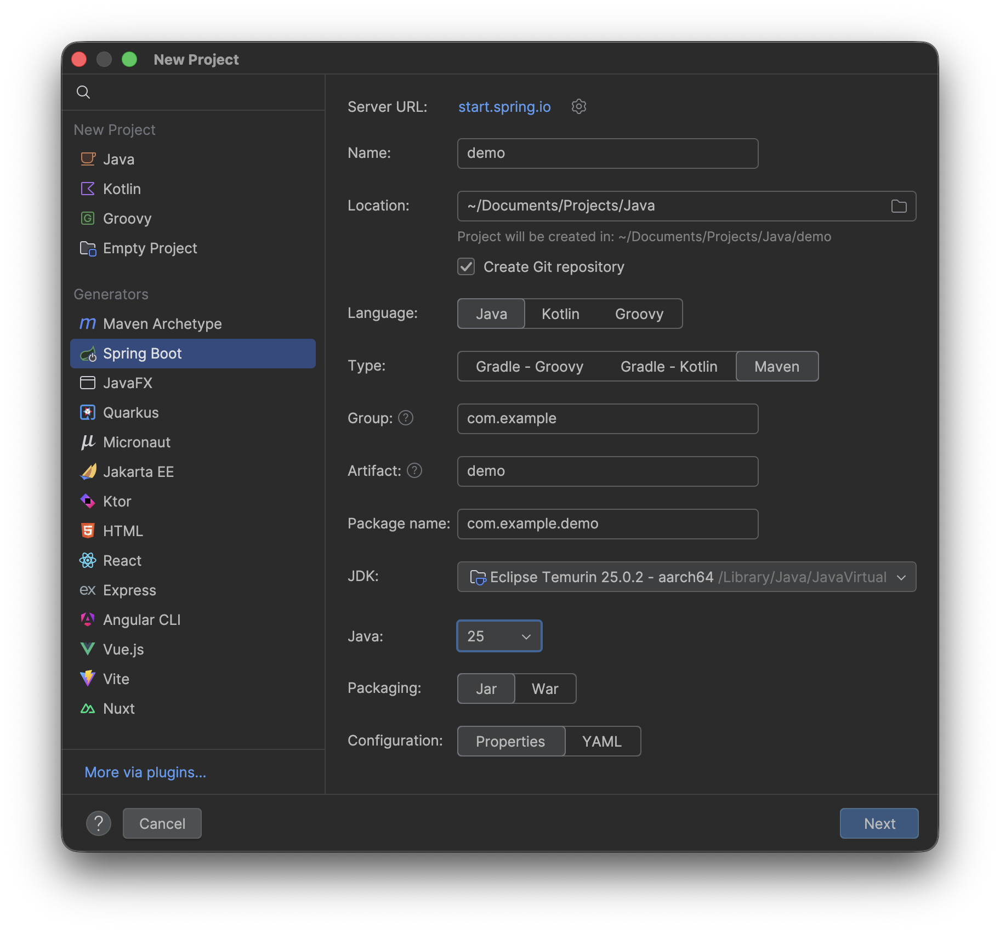
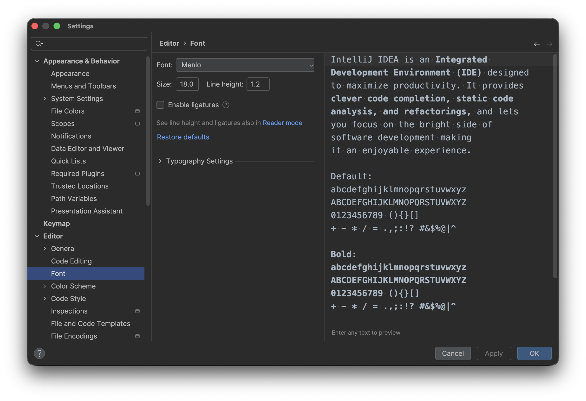
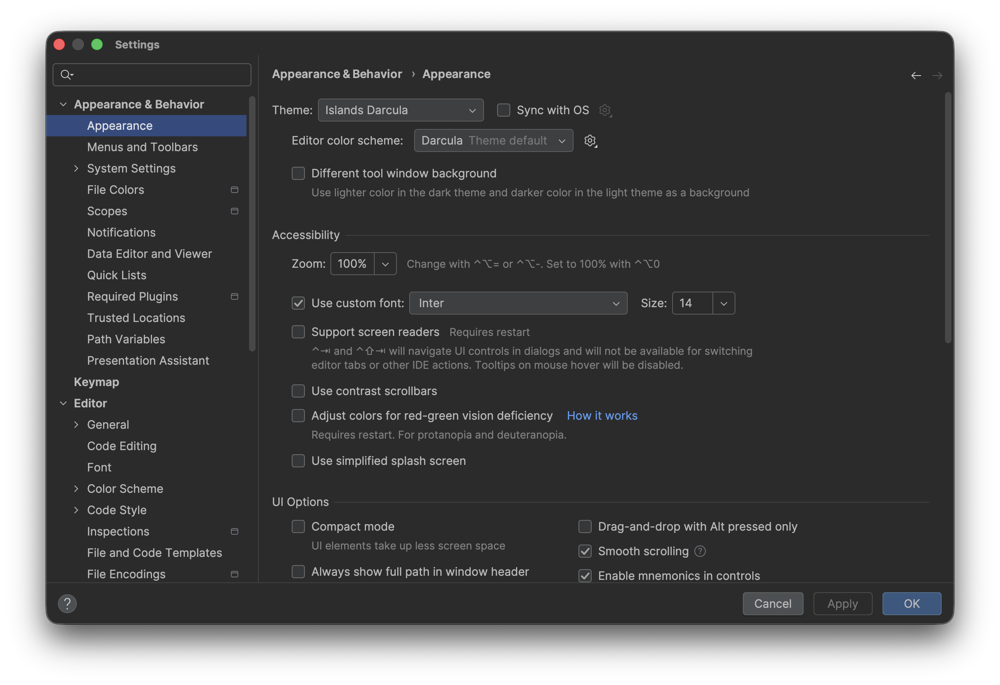
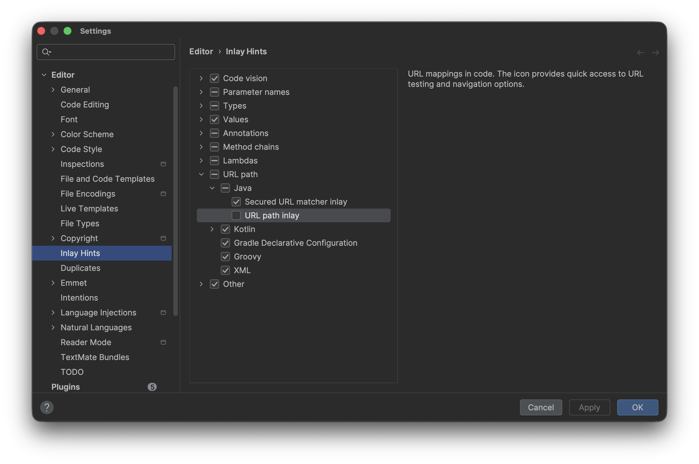

# 單元 4 - 第一個 Spring Boot 程式

### New Project

JDK 和 Java 的值要是一致的

JAVA 25 開發 Spring Boot 4.1

Web → Spring Web



修改編輯區字體大小 (Editor › Font)



修改側邊欄字體大小 (Appearance & Behavior › Appearance)



把小地球的功能給關掉 (Editor › Inlay Hints)



MyController.java

```java
@RestController
public class MyController {

    @RequestMapping("/test")
    public String test() {
        System.out.println("Hi");
        return "Hello World";
    }
}
```

Console: Started DemoApplication in 0.475 seconds (process running for 0.669)

[http://localhost:8080/test](http://localhost:8080/test)

伺服器後台會印出 `Hi`, 瀏覽器畫面上會顯示 `Hello World`
