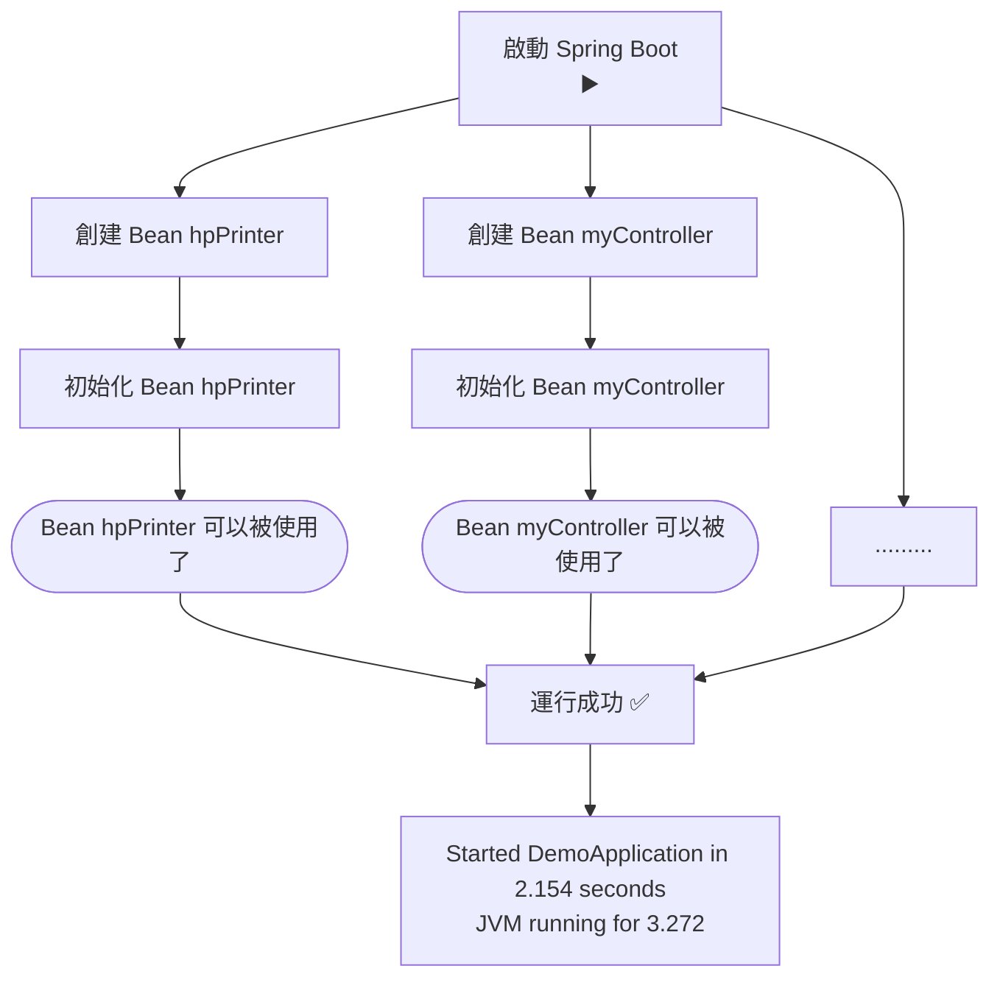

# 單元 6 - Bean 的生命週期

- 要所有 Bean 都可以被使用之後，Spring Boot 才會運行成功 (只要有一個失敗就不行)
- Spring 必須去處理 Bean 之間的依賴關係，MyController 依賴於 Printer，所以 Spring 就會先去創建和初始化 hpPrinter 這個 Bean
- 不要寫出循環依賴的 code

```mermaid
flowchart TD
    Start["啟動 Spring Boot<br/>▶️"]

    Start --> CreateHP["創建 Bean hpPrinter"]
    Start --> CreateMC["創建 Bean myController"]
    Start --> Others["........."]

    CreateHP --> InitHP["初始化 Bean hpPrinter"]
    CreateMC --> InitMC["初始化 Bean myController"]

    InitHP --> ReadyHP(["Bean hpPrinter 可以被使用了"])
    InitMC --> ReadyMC(["Bean myController 可以被使用了"])

    ReadyHP --> Success
    ReadyMC --> Success
    Others --> Success

    Success["運行成功 ✅"]
    Success --> Log["Started DemoApplication in 2.154 seconds<br/>JVM running for 3.272"]
```
