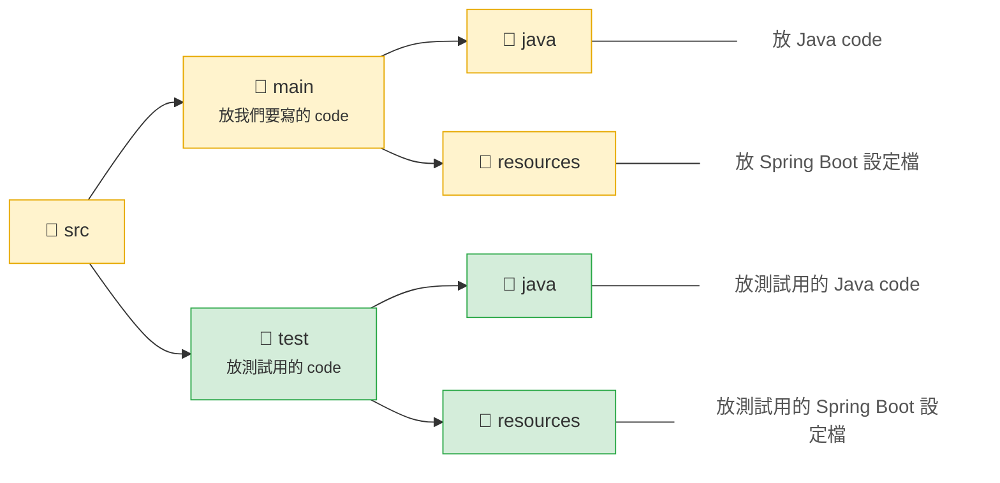

# 單元 7 - 讀取 Spring Boot 設定檔 - application.properties + @Value

Spring Boot project 結構



Spring Boot 設定檔 - application.properties

- 用法：使用 properties 語法 (`key=value`)
    - key 的名字可以帶有`.`符號，意義等於中文的`的`
- 用途：存放 Spring Boot 的設定值
- 有的時候副檔名會是 `properties`，有的時候會是 `yml`

```markdown
count=5
my.name=John
my.age=20
# this is a comment
```

```yaml
count: 5
my:
  name: John
  age: 20
# this is a comment
```

### @Value

- 用法：加在 Bean 或是加在帶有 `@Configuration` 註解裡面的 class
- 用途：讀取 Spring Boot 設定檔 (`application.properties`) 中指定的 key 的值

```java
@Component
public class MyBean {

    @Value("${count}")
    private Integer count; // 5
}
```

```java
@Component // 也可以換成 @Configuration 註解
public class MyBean {

    @Value("${my.name}")
    private String name; // 類型要一致
}
```

可以設定預設值

```java
@Component
public class MyBean {

    @Value("${unknown:Amy}") // 當找不到對應的 key, 就會用此預設值
    private String name;
}
```