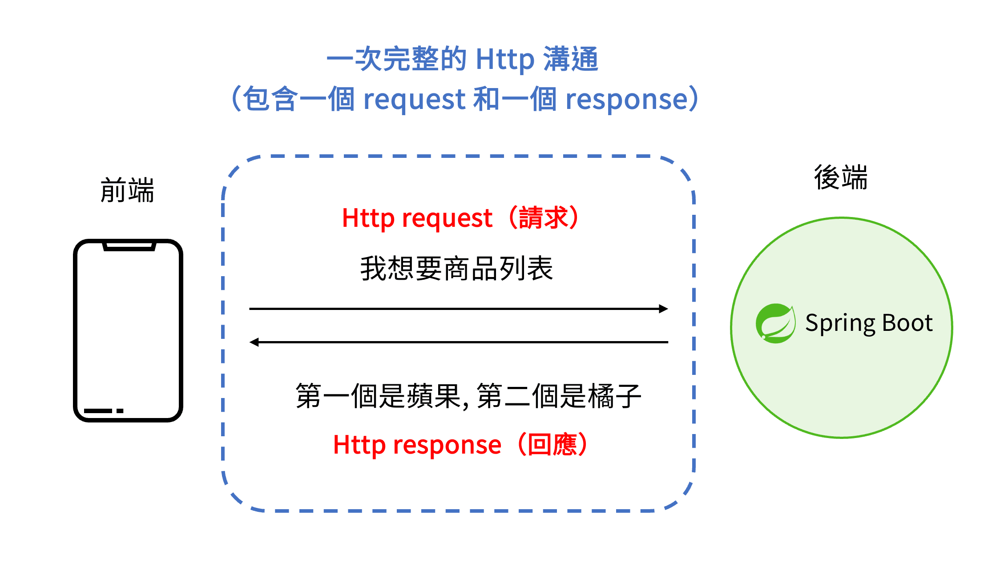
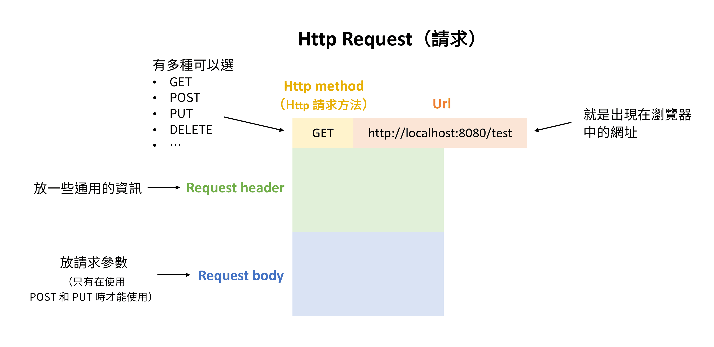
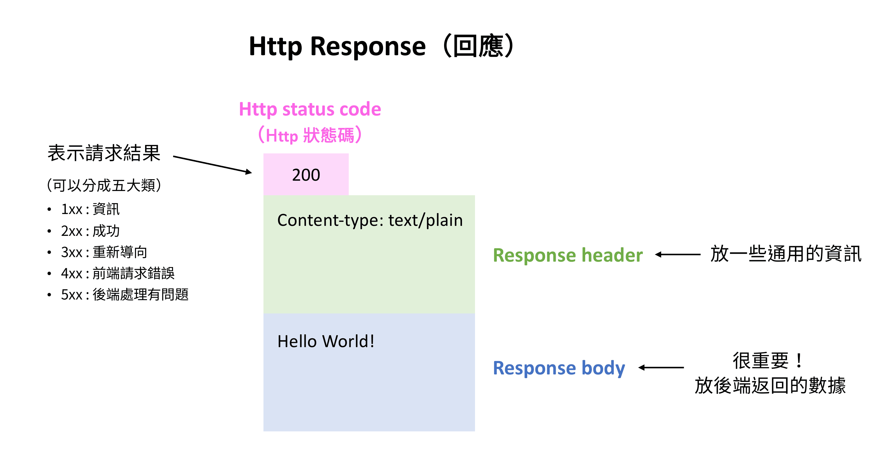

# 單元 2 - Http 協議

### Http 協議

- 負責規定資料的傳輸格式，讓前端和後端能夠有效的進行資料溝通
- 可以分成 request (請求) 和 response (回應) 兩部分

### Http Request（請求）

- Http method (Http 請求方法)
    - GET、POST、`PUT` (整體替換)、`PATCH` (局部更新)、DELETE
- Request-URI：瀏覽器中的網址
- Request header：請求時的通用資訊
    - `Authorization`：用來傳遞 API Key 或登入憑證（如 `Bearer <token>`）
    - `User-Agent`：告訴伺服器你正在用什麼瀏覽器（Chrome, Safari）和作業系統
    - `Accept`：告訴伺服器你支援什麼格式（如 `text/html`, `application/json`）
- Request body：請求的參數
    - 只有在使用 POST、PUT 或是 PATCH 的請求方法時才能使用

### Http Response（回應）

- Http status code (Http 狀態碼)
    - `1xx`：資訊 (Informational)
    - `2xx`：成功 (Successful)
        - `200 OK`：請求成功
        - `201 Created`：POST 創建資源成功
        - `202 Accepted`：請求已經被接受了，但是尚未處理完成
    - `3xx`：重新導向 (Redirection)
        - `301 Moved Permanently`：資源已「永久」移動到新的網址，會轉移權重
        - `308 Permanent Redirect`：308 是 301 的「嚴格版本」必須保持原始請求方法
        - `302 Found`：url 「暫時性」的搬家，權重保留在原網址

        不管是回傳 301 或是 302，後端都是會將新的（臨時的）url 放在 response header 的 `Location` 中，供前端存取新網址

    - `4xx`：用戶端錯誤 (Client Error)
        - `400 Bad Request`：請求語法錯誤，伺服器看不懂。
        - `401 Unauthorized`：需要身分驗證（例如未登入，帳密輸入錯誤）。
        - `403 Forbidden`：伺服器理解請求，但「拒絕」執行（通常是已經登入但權限不足）。
        - `404 Not Found`：找不到請求的資源（最常見的錯誤，通常是網址打錯或網頁被刪除）。
    - `5xx`：伺服器端錯誤 (Server Error)
        - `503 Service Unavailable`
        - `504 Gateway Timeout`
- Response header
    - `Access-Control-Allow-Origin` CORS 跨網域設定
    - `Content-Type` 資料格式
        - `Content-Type: application/json`：告訴前端這是一包 JSON 資料
- Response body：後端要回傳給前端的數據