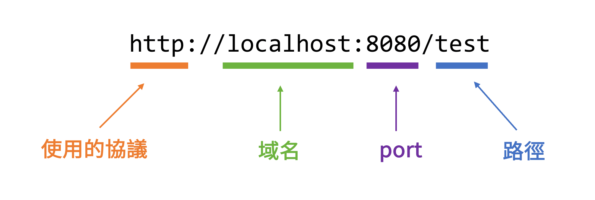

# 單元 3 - URL 路徑對應 - @RequestMapping

Url 的格式規範



### @RequestMapping

- 用法：加在 class 上或方法上，小括號裡填寫 url 路徑
- 用途：將 url 路徑對應到方法上，不包含域名
    - Spring Boot 預設的臨時域名為 [http://localhost:8080](http://localhost:8080/)

```java
@RestController // 把 class 變成 bean
public class MyController {

    @RequestMapping("/test") // 將 url 路徑 /test 對應到 test 方法上
    public String test() {
        System.out.println("Hi!");
        return "Hello World";
    }
}
```

使用 `@RequestMapping` 時，class 上一定要加上 `@Controller` 或是 `@RestController`

`@RequestMapping` 加在 class 上

```java
@RequestMapping("/detail")
@RestController
public class MyController {

    @RequestMapping("/product") // 將url路徑 /detail/product 對應到 product 方法上
    public String product() {
        return "第一個是蘋果，第二個是橘子";
    }

    @RequestMapping("/user") // 將url路徑 /detail/user 對應到 user 方法上
    public String user() {
        return "名字為Judy";
    }
}
```

相等於加在方法上

```java
@RestController
public class MyController {

    @RequestMapping("/detail/product")
    public String product() {
        return "第一個是蘋果，第二個是橘子";
    }

    @RequestMapping("/detail/user")
    public String user() {
        return "名字為Judy";
    }
}
```