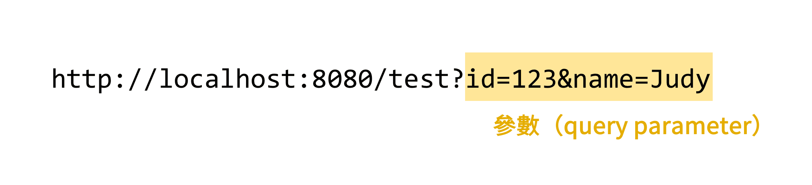

# 單元 7 - 取得請求參數（一）@RequestParam

### @RequestParam

- 用法：只能加在方法的參數上
- 用途：取得 url 裡面的參數



```java
@RestController
public class MyController {

    @RequestMapping("/test1")
    public String test1(@RequestParam Integer id) {
        System.out.println("id: " + id); // sout shortcut
        return "Hello test1";
    }
}
```

傳遞多個參數 GET [http://localhost:8080/test1?id=123&name=Judy](http://localhost:8080/test1?id=123&name=Judy)

多傳的參數會被 Spring Boot 忽略

```java
@RestController
public class MyController {

    @RequestMapping("/test1")
    public String test1(@RequestParam Integer id,
                        @RequestParam String name) {
        System.out.println("id: " + id);
        System.out.println("name: " + name);
        return "Hello test1";
    }
}
```

### @RequestParam 可使用的設定

- name（or value）：指定 url 參數的名字
- `required`：是否是必須的參數？
    - 預設是 `true`，可以改成 `false`

```java
@RestController
public class MyController {

    @RequestMapping("/test1")
    public String test1(@RequestParam Integer id,
                        @RequestParam(required = false) String name) { // name: null
        System.out.println("id: " + id);
        System.out.println("name: " + name);
        return "Hello test1";
    }
}
```

- defaultValue :`required = false` 的加強版，提供預設值

```java
@RestController
public class MyController {

    @RequestMapping("/test1")
    public String test1(@RequestParam Integer id,
                        @RequestParam(defaultValue = "Amy") String name) { // name: Amy
        System.out.println("id: " + id);
        System.out.println("name: " + name);
        return "Hello test1";
    }
}
```