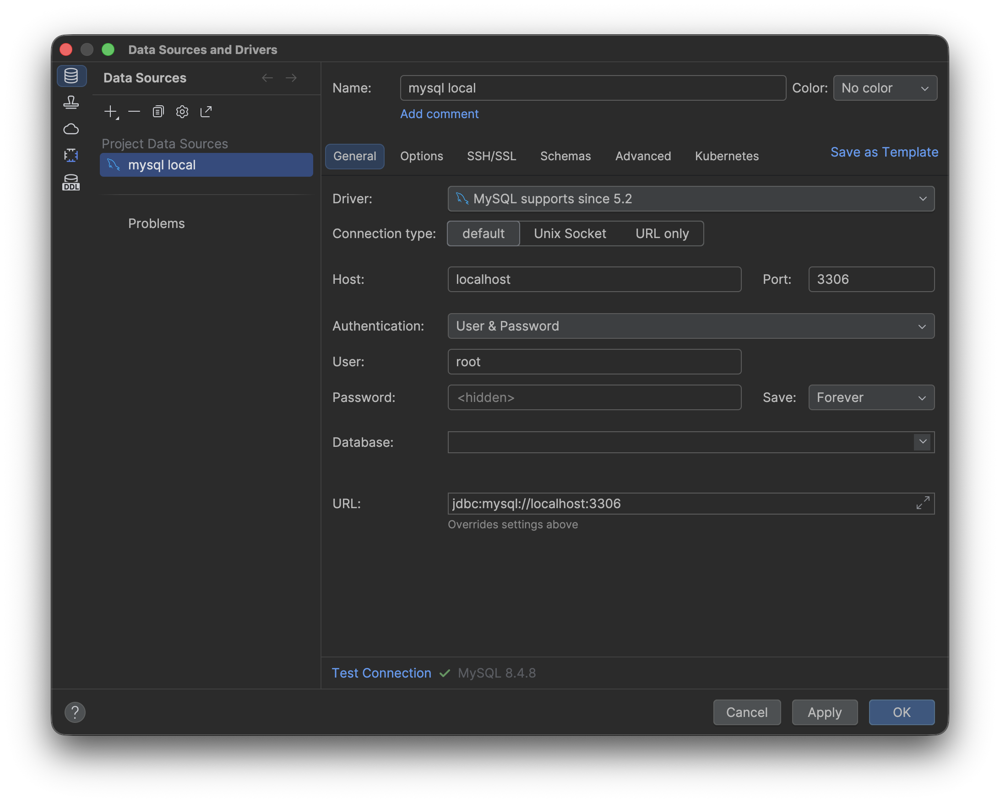
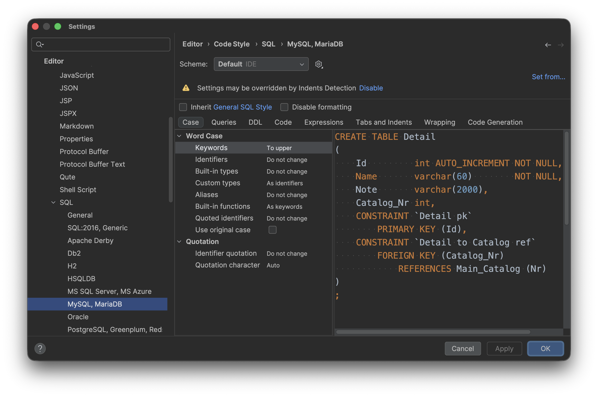

# 單元 2 - 使用 IntelliJ 管理資料庫的數據

IntelliJ 所提供的 Database 功能可取代掉 MySQL Workbench



設定 SQL 關鍵字自動轉大寫



在 console 中去執行 SQL 語法

```sql
CREATE DATABASE myjdbc
```

Command + Enter shortcut (`⌘` + `Return`)

```sql
CREATE TABLE student (
    id INT PRIMARY KEY,
    name VARCHAR(30)
)
```

```sql
INSERT INTO student(id, name) VALUE (1, 'Judy')
```

```sql
SELECT * FROM student
```

```sql
UPDATE student SET name = 'Amy' WHERE id = 1
```

```sql
DELETE FROM student WHERE id = 1
```

IntelliJ 所提供的 `Transpose` 行列反轉，可以解決資料欄位過多需要左右頻繁拉動的問題