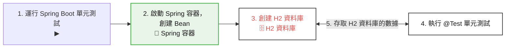

# 單元 10 - 使用 H2 資料庫

## H2 資料庫

- H2 是一種嵌入式資料庫
- 用途：可以在啟動 Spring Boot 時被生成出來，在運行結束時被銷毀，用完即丟

## 使用 H2 資料庫的運作流程

```mermaid
flowchart LR
    Step1["1. 運行 Spring Boot 單元測試<br/>▶"]
    Step2["2. 啟動 Spring 容器，<br/>創建 Bean<br/>🍃 Spring 容器"]
    Step3["3. 創建 H2 資料庫<br/>🗄️ H2 資料庫"]
    Step4["4. 執行 @Test 單元測試"]

    Step1 --> Step2
    Step2 --> Step3
    Step3 <-->|"5. 存取 H2 資料庫的數據"| Step4

    style Step2 fill:#eaf5ea,stroke:#5cb85c,stroke-width:2px,color:#1a1a1a
    style Step3 fill:#ffffff,stroke:#333333,stroke-width:1.5px,color:#d9534f
    style Step4 fill:#ffffff,stroke:#333333,stroke-width:1.5px,color:#1a1a1a
```

6. 單元測試運行完畢，銷毀 Spring 容器，銷毀 H2 資料庫，IntelliJ 顯示單元測試結果
