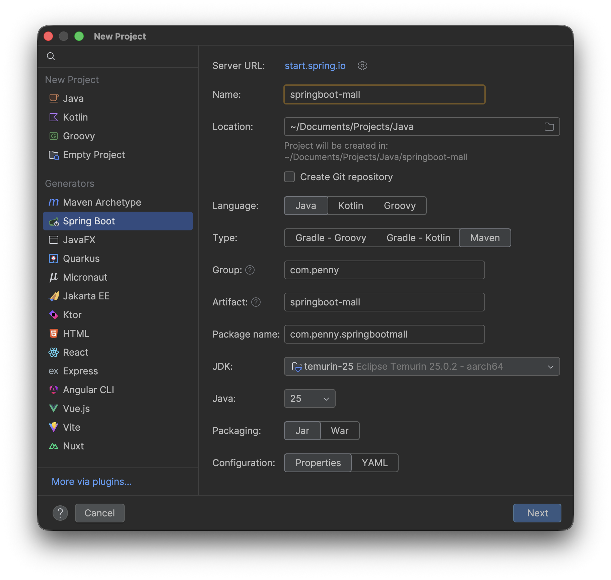
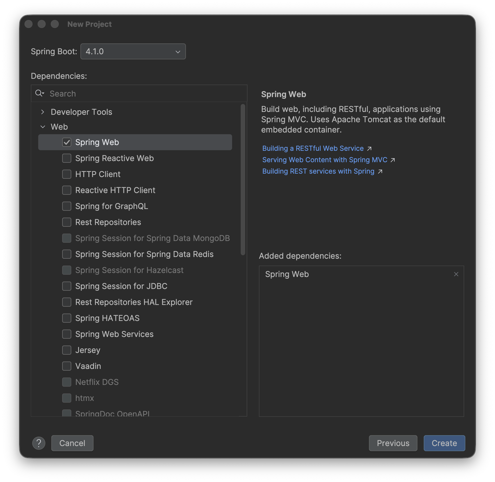
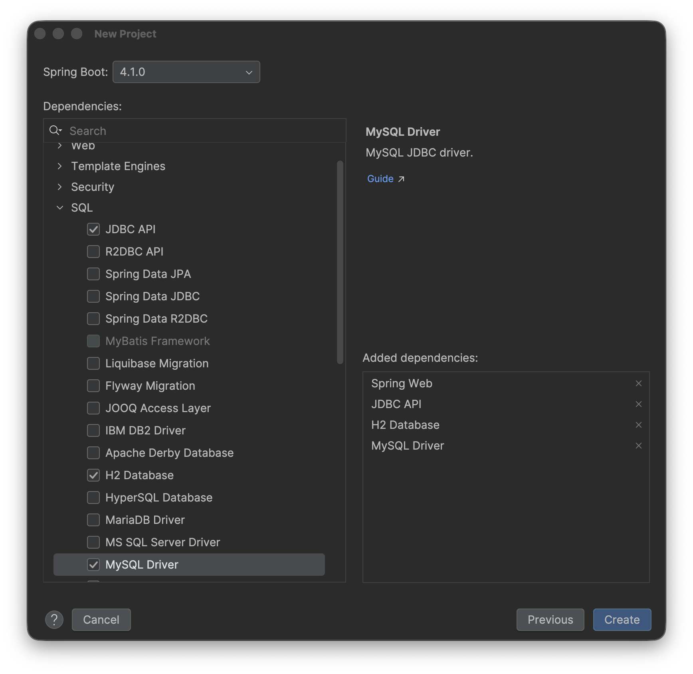

# 單元 2 - 創建 Spring Boot project、設定 Git

1. Clone Repository

    `git@github.com:ytliuSVN/springboot-mall.git`

2. 進到 /Users/penny/Documents/Projects/Java/springboot-mall
3. 刪掉 `.idea` 的隱藏資料夾

    顯示隱藏檔案的快捷鍵：同時按下 **`Command` + `Shift` + `.`**

4. New Project

    

    Web

    

    SQL

    